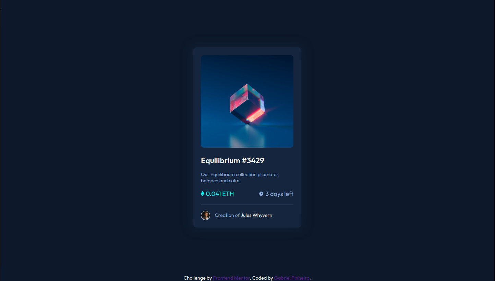
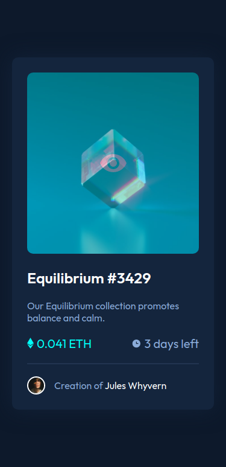

# Frontend Mentor - NFT preview card component solution

This is a solution to the [NFT preview card component challenge on Frontend Mentor](https://www.frontendmentor.io/challenges/nft-preview-card-component-SbdUL_w0U).

## Table of contents

- [Overview](#overview)
  - [The challenge](#the-challenge)
  - [Screenshot](#screenshot)
  - [Links](#links)
- [My process](#my-process)
  - [Built with](#built-with)
  - [What I learned](#what-i-learned)
  - [Useful resources](#useful-resources)
- [Author](#author)

## Overview

### The challenge

Users should be able to:

- View the optimal layout depending on their device's screen size
- See hover states for interactive elements

### Screenshot




### Links

- Solution URL: [https://www.frontendmentor.io/solutions/creating-a-nft-preview-card-component-o0QImMoJY](https://www.frontendmentor.io/solutions/creating-a-nft-preview-card-component-o0QImMoJY)
- Live Site URL: [https://gabrielfmpinheiro.github.io/NFT-Preview-card-component/](https://gabrielfmpinheiro.github.io/NFT-Preview-card-component/)

## My process

### Built with

- Semantic HTML5 markup
- CSS Flexbox
- Mobile-first workflow

### What I learned

```css
/* overlap elements with hover */

.img-container {
  position: relative;
}

.eye-img-container {
  align-items: center;
  background-color: hsl(178, 100%, 50%);
  border-radius: 10px;
  display: flex;;
  height: 300px;
  justify-content: center;
  opacity: 0;
  position: absolute;
  top: 0;
  width: 100%;
}

.eye-img-container:hover {
  opacity: 40%;
  z-index: 1000;
}
```
### Useful resources

- [w3schools](https://www.w3schools.com/css/) - This helps me understand some features of css
- [Mr. Web Design](https://www.youtube.com/channel/UCKwgH3vASrD2brd1l2m6NHw) - This is an amazing channel which helped me to have some creativity.

## Author

- Linkedin- [Gabriel Pinheiro](https://www.linkedin.com/feed/)
- Frontend Mentor - [@GabrielFMPinheiro](https://www.frontendmentor.io/profile/GabrielFMPinheiro)
- Codewars - [@GabrielFMPinheiroe](https://www.codewars.com/users/GabrielFMPinheiro)
